# Classmate — Entity Relationship Diagram

```mermaid
erDiagram
    User {
        string id PK
        string email UK
        string name
        string image
        boolean emailVerified
        string role
        datetime createdAt
        datetime updatedAt
    }

    UserProfile {
        string id PK
        string userId FK
        string displayName
        string bio
        string avatarUrl
        string university
        string major
        int reputation
        datetime createdAt
        datetime updatedAt
    }

    Session {
        string id PK
        string userId FK
        string token UK
        datetime expiresAt
        string ipAddress
        string userAgent
        datetime createdAt
        datetime updatedAt
    }

    Account {
        string id PK
        string userId FK
        string accountId
        string providerId
        string accessToken
        string refreshToken
        datetime accessTokenExpiresAt
        datetime refreshTokenExpiresAt
        string scope
        string idToken
        string password
        datetime createdAt
        datetime updatedAt
    }

    Verification {
        string id PK
        string identifier
        string value
        datetime expiresAt
        datetime createdAt
        datetime updatedAt
    }

    ForumPost {
        string id PK
        string userId FK
        string title
        string content
        string category
        int upvotes
        int views
        boolean isAnswered
        int repliesCount
        datetime createdAt
        datetime updatedAt
    }

    ForumReply {
        string id PK
        string postId FK
        string userId FK
        string content
        int upvotes
        boolean isAccepted
        datetime createdAt
        datetime updatedAt
    }

    ForumTag {
        string id PK
        string name UK
        datetime createdAt
    }

    ChatMessage {
        string id PK
        string senderId FK
        string recipientId FK
        string sessionId FK
        string content
        string role
        string messageType
        boolean isRead
        datetime createdAt
    }

    ChatSession {
        string id PK
        string userId FK
        string title
        string subject
        string description
        datetime createdAt
        datetime updatedAt
    }

    StudyMaterial {
        string id PK
        string userId FK
        string title
        string description
        string fileUrl
        string subject
        string fileType
        int downloads
        datetime createdAt
        datetime updatedAt
    }

    StudyGroup {
        string id PK
        string ownerId FK
        string name
        string description
        string subject
        int maxMembers
        boolean isPrivate
        string inviteCode
        int memberCount
        datetime createdAt
        datetime updatedAt
    }

    StudyGroupMember {
        string id PK
        string groupId FK
        string userId FK
        string role
        datetime joinedAt
    }

    StudyGroupMessage {
        string id PK
        string groupId FK
        string senderId FK
        string content
        datetime createdAt
    }

    FlaggedContent {
        string id PK
        string reporterId FK
        string contentType
        string contentId
        string reason
        string status
        string resolvedBy FK
        string resolution
        datetime createdAt
        datetime resolvedAt
    }

    Event {
        string id PK
        string userId FK
        string title
        string description
        datetime date
        string startTime
        string endTime
        string category
        datetime createdAt
        datetime updatedAt
    }

    Connection {
        string id PK
        string senderId FK
        string recipientId FK
        string status
        datetime createdAt
        datetime updatedAt
    }

    ModerationLog {
        string id PK
        string actorId FK
        string action
        string targetId
        string targetType
        string reason
        string metadata
        datetime createdAt
    }

    Notification {
        string id PK
        string userId FK
        string type
        string message
        boolean isRead
        datetime createdAt
    }

    %% Auth & Profile
    User ||--o| UserProfile : "has profile"
    User ||--o{ Session : "has sessions"
    User ||--o{ Account : "has accounts"

    %% Forums
    User ||--o{ ForumPost : "creates"
    User ||--o{ ForumReply : "writes"
    User }o--o{ ForumPost : "upvotes"
    User }o--o{ ForumReply : "upvotes"
    ForumPost ||--o{ ForumReply : "has"
    ForumPost }o--o{ ForumTag : "tagged with"

    %% Chat
    User ||--o{ ChatSession : "owns"
    User ||--o{ ChatMessage : "sends"
    User ||--o{ ChatMessage : "receives"
    ChatSession |o--o{ ChatMessage : "contains"

    %% Study Materials
    User ||--o{ StudyMaterial : "uploads"

    %% Study Groups
    User ||--o{ StudyGroup : "owns"
    User ||--o{ StudyGroupMember : "joins as"
    User ||--o{ StudyGroupMessage : "sends"
    StudyGroup ||--o{ StudyGroupMember : "has"
    StudyGroup ||--o{ StudyGroupMessage : "contains"

    %% Moderation
    User ||--o{ FlaggedContent : "reports"
    User |o--o{ FlaggedContent : "resolves"
    User ||--o{ ModerationLog : "performs"

    %% Social
    User ||--o{ Connection : "sends"
    User ||--o{ Connection : "receives"
    User ||--o{ Event : "creates"
    User ||--o{ Notification : "receives"
```

## Enums

| Enum                   | Values                                                                                    |
| ---------------------- | ----------------------------------------------------------------------------------------- |
| `UserRole`             | `STUDENT`, `MODERATOR`, `ADMIN`, `OWNER`                                                  |
| `ConnectionStatus`     | `PENDING`, `ACCEPTED`, `REJECTED`                                                         |
| `FlagStatus`           | `pending`, `dismissed`, `resolved`                                                        |
| `ModerationAction`     | `FLAG_CREATED`, `FLAG_RESOLVED`, `CONTENT_DELETED`                                        |
| `ModerationTargetType` | `post`, `reply`, `material`, `ForumPost`, `ForumReply`, `StudyMaterial`, `FlaggedContent` |

## Domain Summary

| Domain          | Models                                                      |
| --------------- | ----------------------------------------------------------- |
| Auth & Identity | `User`, `UserProfile`, `Session`, `Account`, `Verification` |
| Forums          | `ForumPost`, `ForumReply`, `ForumTag`                       |
| Messaging       | `ChatMessage`, `ChatSession`                                |
| Study Materials | `StudyMaterial`                                             |
| Study Groups    | `StudyGroup`, `StudyGroupMember`, `StudyGroupMessage`       |
| Social          | `Connection`, `Event`, `Notification`                       |
| Moderation      | `FlaggedContent`, `ModerationLog`                           |
