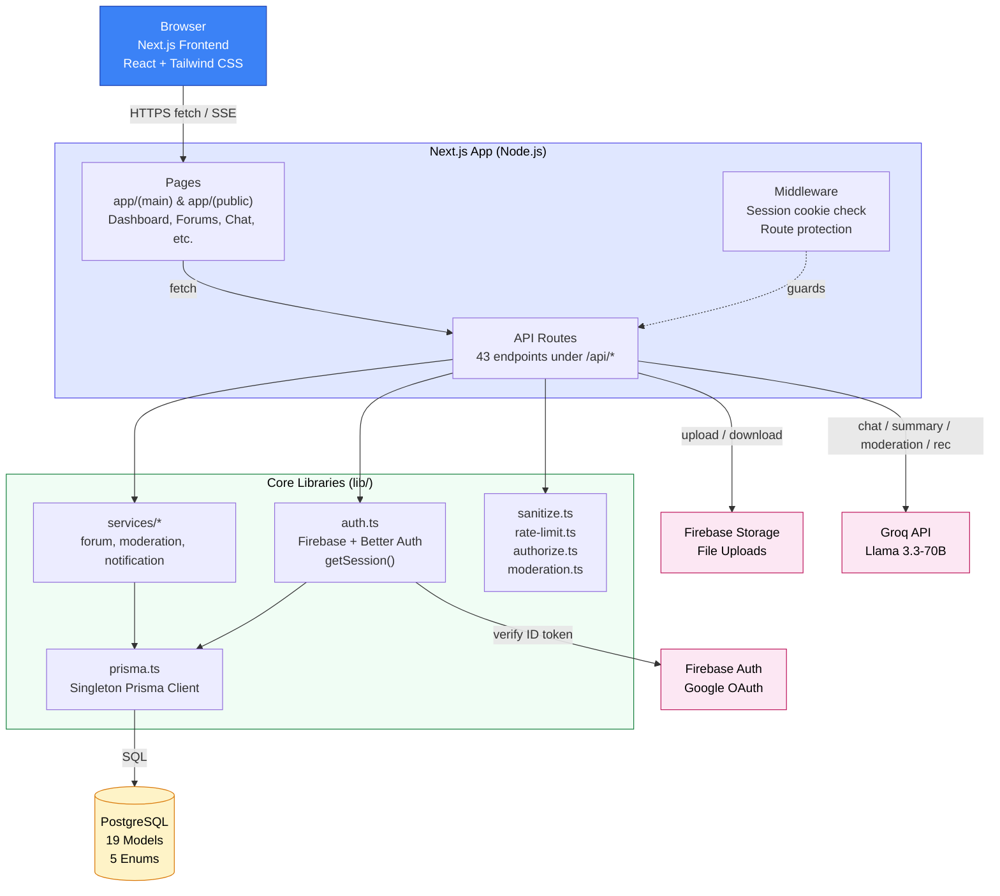

# 5. System Architecture

[← Back to README](../../README.md)

---

## 5.1 High-Level System Architecture

---

## 5.2 Architecture Explanation

### Frontend ↔ API ↔ Database Interaction

1. **Client → API:** The browser makes `fetch` calls to Next.js API routes (`/api/*`). Server-rendered pages call service functions directly without going through HTTP.
2. **API → Database:** All database access goes through `lib/prisma.ts` (singleton Prisma client). No database connection is ever exposed to the frontend.
3. **API → AI:** The AI Tutor route streams tokens from the Groq API back to the client via Server-Sent Events. Moderation, summarization, and recommendations are synchronous Groq calls inside API handlers.
4. **File Uploads:** Study materials are stored either in Firebase Storage (production) or `public/uploads/` (local dev), with magic-byte validation before acceptance.

### Separation of Concerns

| Layer              | Responsibility                                     | Modules                                       |
| :----------------- | :------------------------------------------------- | :-------------------------------------------- |
| Presentation       | UI rendering, user interaction                     | `app/(main)/`, `app/(public)/`, `components/` |
| HTTP/Routing       | Request handling, response shaping                 | `app/api/*` (43 route files)                  |
| Business Logic     | Domain rules for forums, moderation, notifications | `lib/services/*`                              |
| Authentication     | Session resolution                                 | `lib/auth.ts` (Firebase + Better Auth)        |
| Authorization      | Role enforcement                                   | `lib/authorize.ts`                            |
| Input Sanitization | XSS prevention, HTML stripping                     | `lib/sanitize.ts`                             |
| Rate Limiting      | Throttling, abuse prevention                       | `lib/rate-limit.ts` (5 tiers)                 |
| AI Moderation      | Content safety scoring, fail-closed                | `lib/moderation.ts`                           |
| Data Access        | SQL generation, type-safe queries                  | `lib/prisma.ts` + Prisma schema               |
| External Services  | OAuth, storage, AI                                 | Firebase Auth/Storage, Groq                   |

### Where Security Is Enforced

- **Middleware (`middleware.ts`):** Checks for `session` (Firebase) or `better-auth.session_token` cookie on every protected route; rewrites to 404 if absent.
- **API layer:** Every protected endpoint calls `getSession()` and returns `401` if no valid session exists. Role-restricted endpoints call `requireModerator()` / `requireAdmin()`.
- **Input layer:** All user-supplied strings pass through `lib/sanitize.ts` (HTML stripping + entity encoding) before storage.
- **AI moderation:** Every `POST` to forum posts, replies, and chat messages passes through the Groq moderation check; content is rejected if moderation returns a violation or if Groq is unavailable (fail-closed).
- **Rate limiting (5 tiers):** `aiLimiter` 20/hr · `moderationLimiter` 60/min · `authLimiter` 10/15min · `writeLimiter` 30/min · `generalLimiter` 100/min.
- **CSRF:** Firebase session cookie uses `sameSite: 'strict'`, `httpOnly: true`; Better Auth has CSRF protection enabled by default.
